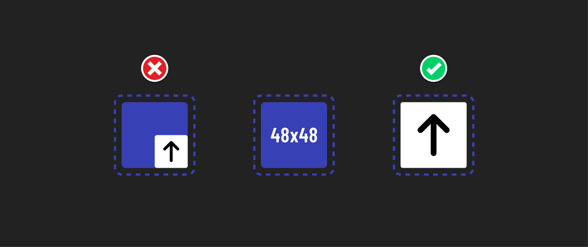

<h1>
  Intro to Accessibility
  Mobility Accommodations
</h1>

**Learning objective:** By the end of this lesson students will be able to apply techniques to make web content accessible for individuals with mobility disabilities, including keyboard navigation and responsive design principles.

## What are mobility disabilities?

Mobility accommodations can help people with arthritis, Parkinson's, MS, quadriplegia, paraplegia, and limb differences. Elderly users may also lack fine motor skills. These conditions have unique accessibility requirements and affect motor function to varying degrees.

## Accommodating mobility disabilities

Here are some way that we can improve accessibility for users with mobility disabilities:

- Ensure buttons and links are large enough to be easily tapped with a finger or other pointing device. This is depicted above. Easy to tap elements should have a minimum surface area of 48px x 48px.
- Provide keyboard navigation. This allows users to navigate a website or app using only a keyboard. This option is critical for those who find it difficult to use a mouse or other pointing device.
- Minimize interactions where users are required to click and drag items.
- Use clear and consistent labels for all interactive elements. This will help users understand what each element does and how to interact with it, regardless of how they interact with the website. This can even help people who need to interact with your site using voice commands.
- Implement responsive design. This will ensure that your website looks good and functions well on all devices, regardless of screen size.

### Who benefits?

Beyond benefitting people with long-term mobility challenges, others can benefit from these accommodations as well:

- Those with short-term disabilities like repetitive strain injuries or a broken arm.
- Multitasking users with only one or no hands available to interact with their devices. The user may be carrying out other activities like holding a baby, cooking food, and so on.

### 🎓 You Do

**Scenario:**
Imagine you are a part of a development team tasked with designing a new e-commerce website. The website will offer a range of products and services and will be viewable on all devices.

**Task:** How would you apply the techniques learned in this lesson to accommodate individuals with mobility disabilities? List two considerations you would make when designing product card interactions on mobile devices.
