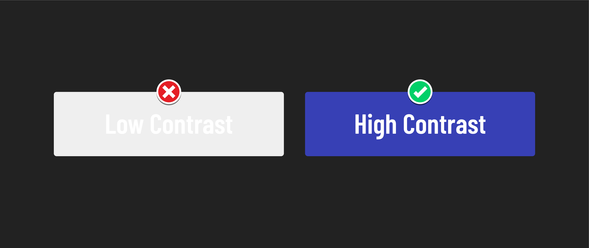

<h1>
  <span class="headline">Intro to Accessibility</span>
  <span class="subhead">Visual Accommodations</span>
</h1>

**Learning objective:** By the end of this lesson students will be able to accommodate users with visual disabilities through the use of alternative text, color contrast, and non-color indicators.

## What are visual disabilities?

Visual disabilities encompass conditions like blindness, low vision, and color blindness. Individuals with visual disabilities may face challenges in seeing or distinguishing between colors.

## Accommodating visual disabilities

We can utilize these techniques to accommodate individuals with visual disabilities:

- Include alternative text (alt text) for images to ensure that people who use *screen readers* can comprehend the content of the images.
- Utilize high-contrast colors between text and background to enhance the visibility of text.
- Refrain from relying solely on color to convey information.

> 📚 A *screen reader* is a software application that converts text and other elements on a digital screen into speech or Braille. Users of screen readers can range from people with varying degrees of visual impairment, including those who are completely blind, to individuals with learning disabilities like dyslexia that make processing text challenging.

## Alternative text (alt text)

Alternative text (alt text) is a brief image description that can be understood by screen readers. It is essential to provide alt text for all images, including decorative ones like logos or icons.


In situations where an image cannot be loaded, you might encounter alt text similar to the example above. If the image were visible, it would presumably display a blue car.

Writing effective alt text can be challenging for various reasons, primarily because it attempts to capture what is important about an image in text. However, the important elements in an image can change depending on the context in which the image is used. Sometimes, you may not have information about the context in which the image will be used, and that's perfectly fine.

Although all of these won't apply in all conditions, here are some tips for writing good alt text:

- Keep it concise. Alt text should be as brief as possible while still conveying the image's intended meaning.
- Avoid using words like "image" or "photo." Screen readers will already indicate that the content is an image.
- Be specific. If the image contains text, include that text in the alt text if it's relevant to the context.
- Be consistent. Use the same alt text for the same image wherever it appears on your website, unless the context requires a deviation.
- Capture emotion when applicable. If an image conveys emotional significance or depicts a dramatic or exciting scene, attempt to convey that emotion in the alt text if it's relevant.

For more info, [this video from Google](https://www.youtube.com/watch?v=flf2vS0IoRs) does a great job explaining how to write good alt text.

### Who benefits?

These accommodations provide advantages for individuals with visual impairments but also extend their benefits to other groups:

- Users with low bandwidth or limited connectivity: In situations where images may not load, alt text can serve as a useful placeholder, ensuring that content remains accessible.
- Users who discover images through search engines: Alt text plays a crucial role in helping search engines understand and categorize the content of images, making it beneficial for a broader audience.

### How to add alt text to an image

You can add alt text to an image by adding the `alt` attribute inside of an `` element, as shown below:

```HTML

```

### 🎓 You Do


Write alt text for the above image without consideration to the context the image will be used in.

Consider the colors in the image, the people or objects present, the style of the image, and any other details you think might be relevant.

## Color contrast



Color contrast is the difference between the brightness of two colors. High color contrast makes text and images easier to read and comprehend.

The [W3C](https://en.wikipedia.org/wiki/World_Wide_Web_Consortium) publishes the [Web Content Accessibility Guidelines (WCAG)](https://en.wikipedia.org/wiki/Web_Content_Accessibility_Guidelines), which companies and governments often reference to help them implement accessibility standards on the web. One of the areas they set standards for is color contrast.

### Who this benefits

Once again, these improvements provide advantages for individuals with visual impairments but also extend their benefits to various groups:

- Individuals without visual impairments: Users without visual impairments also encounter difficulties when dealing with low-contrast visual elements, as they can be challenging to read.
- Individuals using devices outdoors: Sunlight often poses readability challenges for many screens. High contrast can aid visibility when using devices outdoors.
- Individuals using low-quality displays: High-contrast monitors are a relatively recent development and may not be widespread across all display options, so this benefit extends to users with older or lower-quality displays.

### Understanding WCAG color contrast requirements

The Web Content Accessibility Guidelines (WCAG) outline specific color contrast requirements to ensure digital content is accessible to a wide range of users. These guidelines prioritize inclusivity and usability for individuals with various visual abilities.

WCAG 2.0 level AA, which represents the easiest level of compliance, establishes minimum color contrast ratios. These ratios are as follows:

- For normal text: A minimum color contrast ratio of ***4.5:1*** is required. This means that there should be a significant difference in brightness between the text and its background to make it easily readable.
- For large text: When text is 24 pixels (px) or larger, a minimum color contrast ratio of **3:1** is specified. While the requirement is slightly lower for larger text, it still ensures readability for a broader audience.

> 💡 The ratio is expressed as "4.5:1" where the first number (4.5) represents the relative brightness or luminance of the text color, and the second number (1) represents the relative brightness or luminance of the background color.

There are many online tools to check the contrast between two colors.

- [This contrast checker](https://webaim.org/resources/contrastchecker/) built by WebAIM is one the most popular ways to compare the contrast directly between two colors.
- Both [Chrome](https://developer.chrome.com/docs/devtools/accessibility/contrast/) and [Firefox](https://firefox-source-docs.mozilla.org/devtools-user/accessibility_inspector/) have built-in tools to evaluate a website and flag any inaccessible text found on it as well.

There is a recurring theme when implementing accessible content: *simpler is almost always better*. Black text on a white background or white text on a black background will always meet these contrast requirements. That said, you're not restricted from doing something unique. Just ensure it meets the guidelines.

### 🎓 You Do

Add this HTML inside the `<body>`:

```html
<button id="btn">Click me!</button>
```

And this CSS to your CSS file:

```css
#btn {
  background-color: #EFEFEF;
  color: #FFFFFF;
  font-size: 20px;
  padding: 8px 16px;
}
```

Alter the CSS for the button to meet the WCAG 2.0 level AA color contrast requirements.

Can't choose a color? Here are a few cool resources you can explore to help out:

- [Adobe Color](https://color.adobe.com/create/color-wheel)
- [Coolors](https://coolors.co/generate)
- [ColorSpace](https://mycolor.space/)

Don't forget you can always opt for a simpler color palette.

## Conveying meaning without color

While using color to highlight links or warnings can be effective, it should not be the sole method of conveying importance or clickability. This is because individuals perceive colors differently, and we aim to provide an inclusive user experience.

Consider the presentation of links, which traditionally feature distinct colors and are underlined. The underlining is especially beneficial for individuals with color vision differences, such as difficulty distinguishing between blue/black and purple/black, ensuring they can differentiate links from standard text.

Beyond this, underlined links are a widespread and clear pattern used across the internet. By adhering to this design, your users will immediately recognize how to navigate your site, even if they've never visited it.

### Who benefits?

In addition to benefiting users with visual impairments, these practices also provide advantages to:

- People who are not visually impaired. Following established patterns helps all users find familiar landmarks in your application.
- People using devices outdoors or low-quality displays. Sunlight or bad display technology can make colors look washed out. Using signals beyond color increases the visibility of elements.
- A global audience. Cultural interpretations of color can vary, so using language other than color to communicate may be necessary for a site to be usable globally.
